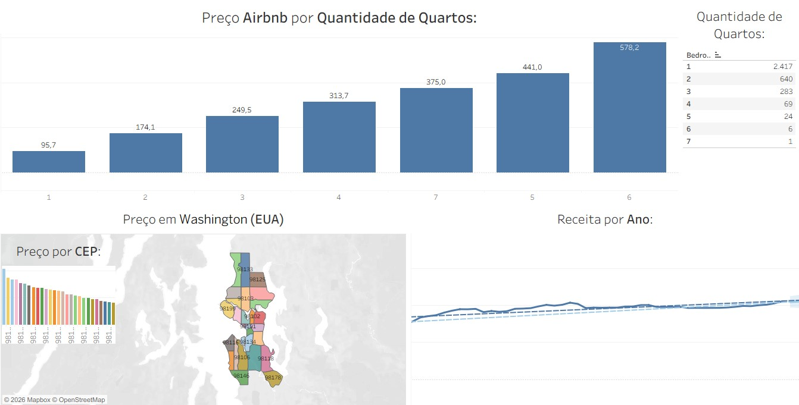

# Dashboard de Análise de Preços – Airbnb (Washington, EUA)

Dashboard desenvolvido no Power BI para análise de **preços, distribuição por quantidade de quartos, localização por CEP e evolução da receita ao longo do tempo** em anúncios do Airbnb na cidade de Washington (EUA).

O projeto tem como objetivo identificar padrões de precificação e tendências de receita no mercado de hospedagem.

---

## Objetivo do Projeto:

Criar um painel analítico para:

- Avaliar o impacto da quantidade de quartos no preço
- Identificar regiões com maiores valores médios
- Analisar a evolução da receita ao longo dos anos
- Apoiar decisões estratégicas para precificação

---

## Principais Análises:

### 🛏 Preço por Quantidade de Quartos

Preço médio conforme número de quartos:

- 1 quarto – $95,7  
- 2 quartos – $174,1  
- 3 quartos – $249,5  
- 4 quartos – $313,7  
- 5 quartos – $441,0  
- 6 quartos – $578,2  
- 7 quartos – $375,0  

Insight:
- Existe crescimento consistente do preço conforme aumenta o número de quartos.
- Imóveis com 6 quartos apresentam o maior preço médio.
- Pequena distorção em imóveis com 7 quartos (possível baixa amostragem).

---

### Preço por CEP (Washington – EUA):

Mapa geográfico destacando variação de preços por região.

Permite identificar:
- Áreas premium
- Regiões com maior concentração de imóveis
- Diferença de preço por localização

Essa análise é essencial para:
- Estratégias de investimento imobiliário
- Definição de preço competitivo
- Estudo de mercado local

---

### Distribuição da Quantidade de Quartos:

Quantidade de anúncios por número de quartos:

- 1 quarto – 2.417 anúncios  
- 2 quartos – 640  
- 3 quartos – 283  
- 4 quartos – 69  
- 5 quartos – 24  
- 6 quartos – 6  
- 7 quartos – 1  

Insight:
- O mercado é fortemente concentrado em imóveis de 1 quarto.
- Imóveis maiores são raros, o que pode justificar preços mais elevados.

---

### Receita por Ano:

Gráfico de linha mostrando tendência de receita ao longo dos anos.

Insight:
- Tendência de crescimento gradual.
- Indicação de expansão do mercado ou aumento de preços médios.

---

## Principais Insights Estratégicos:

- A quantidade de quartos impacta diretamente o preço médio.
- Existe alta concentração de imóveis pequenos (1 quarto).
- Regiões específicas apresentam valorização superior.
- Tendência de crescimento da receita ao longo do tempo.
---
